# n8n Database Entity-Relationship Diagram

This document contains Entity-Relationship diagrams for the n8n database schema using Mermaid notation.

## Core Schema Overview

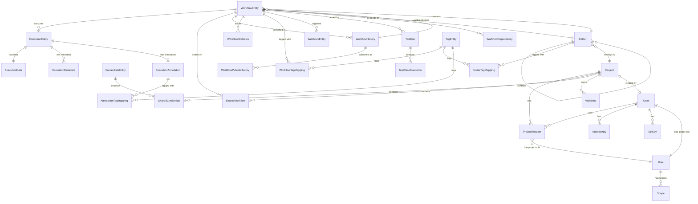

## User & Authentication Schema

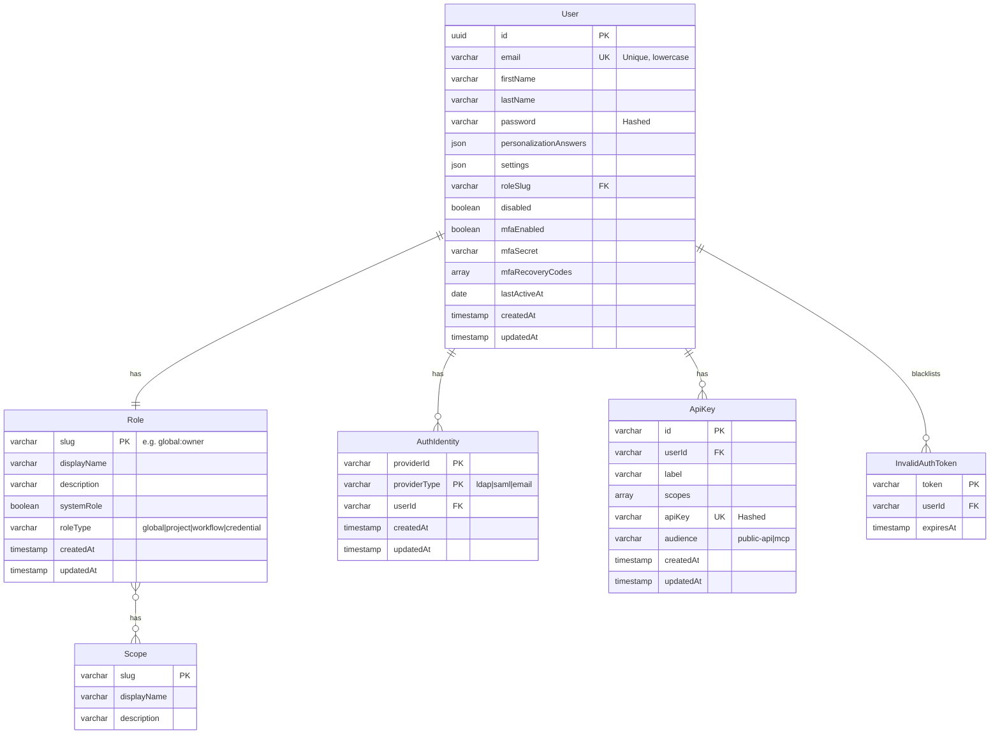

## Project & Collaboration Schema

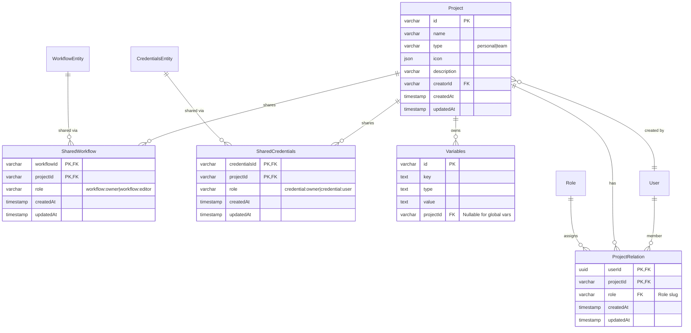

## Workflow Management Schema

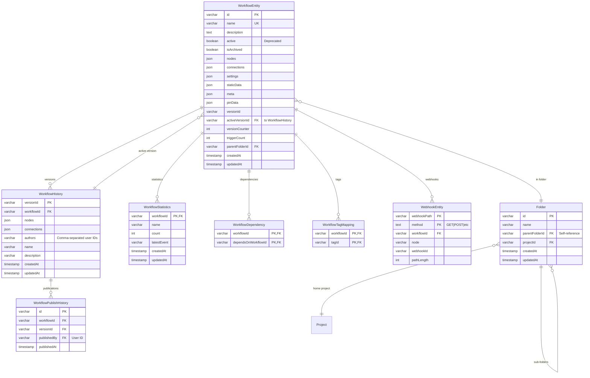

## Execution Tracking Schema

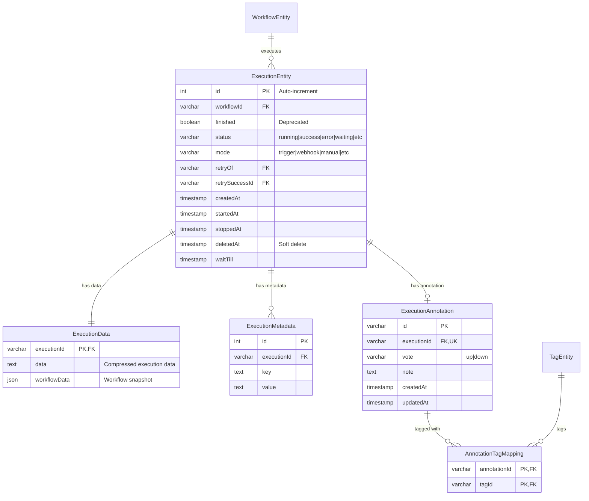

## Credentials Schema

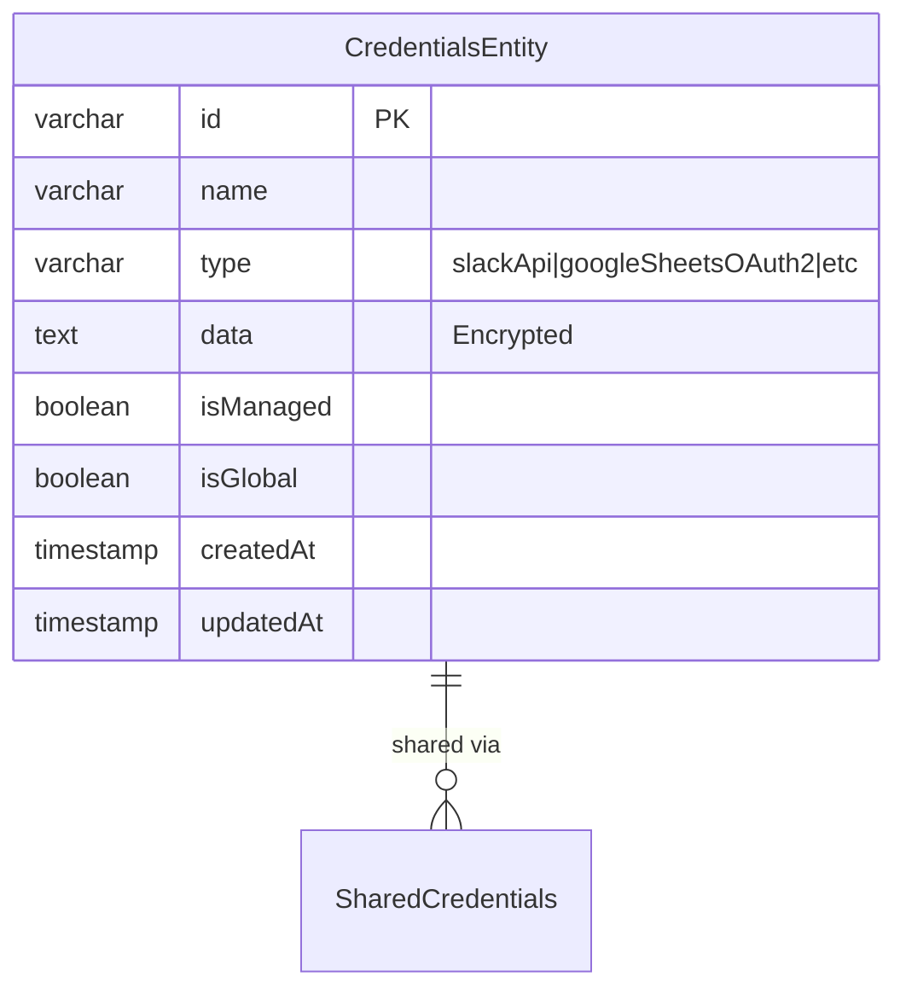

## Tag System Schema

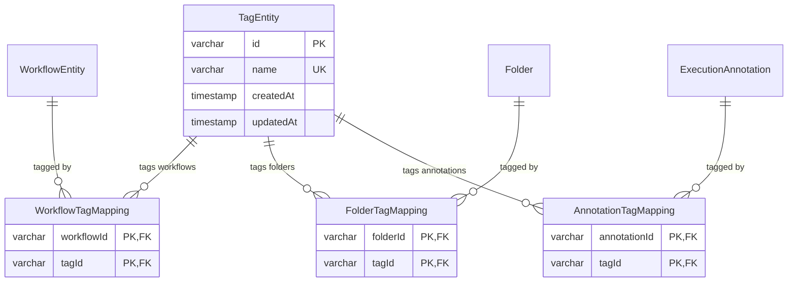

## Settings & Configuration Schema

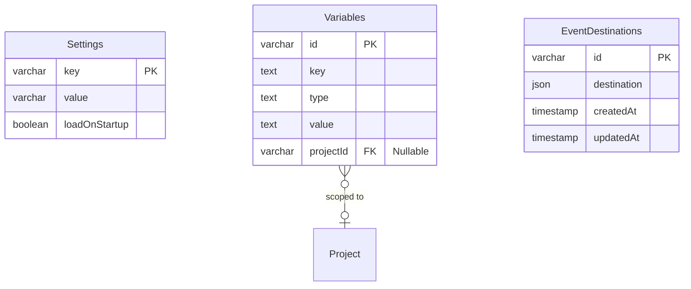

## Binary Data Schema

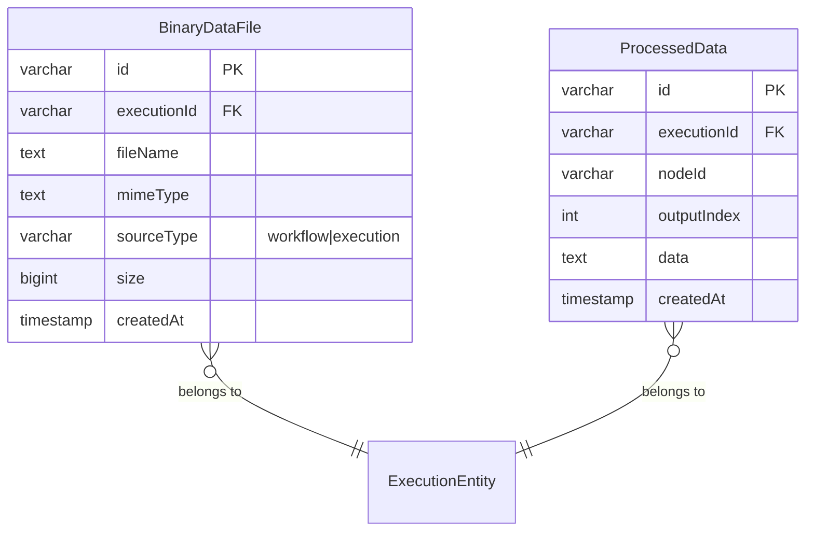

## Testing Schema (Enterprise Edition)

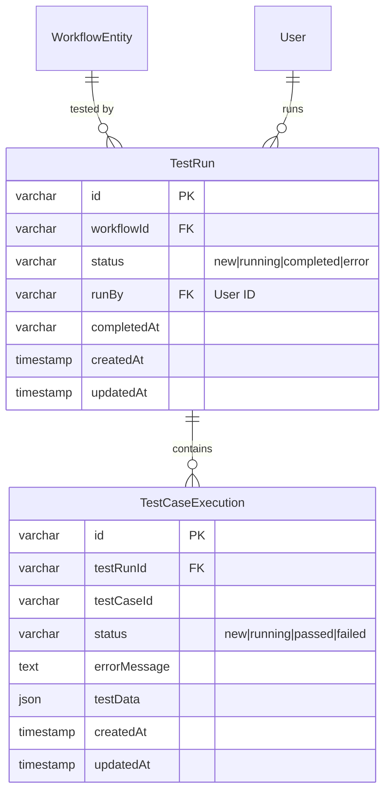

## Authentication Provider Sync

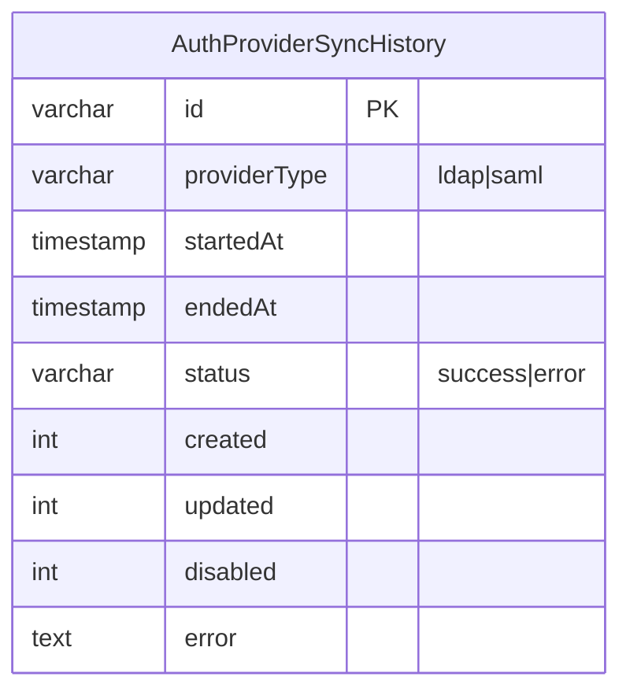

## Database Indexes

### ExecutionEntity Indexes
- `idx_execution_workflow_id` on `(workflowId, id)`
- `idx_execution_wait_till` on `(waitTill, id)`
- `idx_execution_finished` on `(finished, id)`
- `idx_execution_workflow_finished` on `(workflowId, finished, id)`
- `idx_execution_workflow_wait` on `(workflowId, waitTill, id)`
- `idx_execution_stopped_at` on `(stoppedAt)`

### WebhookEntity Indexes
- `idx_webhook_routing` on `(webhookId, method, pathLength)`

### User Indexes
- `idx_user_email` on `(email)` - Unique

### WorkflowEntity Indexes
- `idx_workflow_name` on `(name)` - Unique

### CredentialsEntity Indexes
- `idx_credentials_type` on `(type)`

### TagEntity Indexes
- `idx_tag_name` on `(name)` - Unique

### ApiKey Indexes
- `idx_api_key_api_key` on `(apiKey)` - Unique
- `idx_api_key_user_label` on `(userId, label)` - Unique

## Junction Tables (Many-to-Many Relationships)

1. **workflows_tags**: WorkflowEntity ↔ TagEntity
2. **folder_tag**: Folder ↔ TagEntity
3. **role_scope**: Role ↔ Scope
4. **workflow_tag_mapping**: WorkflowEntity ↔ TagEntity (new structure)
5. **folder_tag_mapping**: Folder ↔ TagEntity (new structure)
6. **annotation_tag_mapping**: ExecutionAnnotation ↔ AnnotationTagEntity

## Column Naming Conventions

- **Primary Keys**: `id` (varchar/uuid/auto-increment)
- **Foreign Keys**: `{entity}Id` (e.g., `userId`, `workflowId`)
- **Timestamps**: `createdAt`, `updatedAt`, `deletedAt`, `stoppedAt`, `startedAt`
- **Boolean flags**: `is{Property}`, `{property}Enabled` (e.g., `isArchived`, `mfaEnabled`)
- **Role columns**: `role` or `roleSlug`

## Data Type Mapping

### Common Types
- `varchar` - Variable-length strings
- `text` - Long text content
- `json` - JSON objects (simple-json in SQLite)
- `timestamp`/`timestamptz`/`datetime` - Timestamps
- `boolean` - True/false flags
- `int`/`integer` - Numeric values
- `uuid` - UUID identifiers (user IDs)
- `simple-array` - Comma-separated values (TypeORM feature)

### Database-Specific
- **JSON**: `json` (PostgreSQL/MySQL), `simple-json` (SQLite)
- **Datetime**: `timestamptz` (PostgreSQL), `datetime` (MySQL/SQLite)
- **Binary**: `bytea` (PostgreSQL), `longblob` (MySQL), `blob` (SQLite)

## Cascade Behaviors

### ON DELETE CASCADE
- `ProjectRelation` → When Project deleted
- `SharedWorkflow` → When Workflow deleted
- `SharedCredentials` → When Credentials deleted
- `ExecutionData` → When ExecutionEntity deleted
- `ExecutionMetadata` → When ExecutionEntity deleted
- `WorkflowHistory` → When WorkflowEntity deleted
- `Folder` → When parent Folder deleted
- `Variables` → When Project deleted (for project-scoped vars)
- `ApiKey` → When User deleted

### ON DELETE SET NULL
- `Project.creator` → When User deleted
- `Variables.project` → When Project deleted (converts to global var)

## Transaction Isolation

- Migrations run in individual transactions (`transaction: 'each'`)
- Repository operations use default isolation level
- `withTransaction` helper available for multi-operation transactions

## Performance Considerations

1. **Execution queries** - Use composite indexes for common filtering patterns
2. **Workflow lookups** - Name is unique indexed for fast search
3. **Webhook routing** - Specialized index on `(webhookId, method, pathLength)`
4. **User authentication** - Email unique index for login
5. **Tag filtering** - Junction tables with both foreign keys indexed

## Notes

- This diagram represents the logical schema; actual table names may include a configurable prefix
- Some entities are Enterprise Edition (EE) only, marked with `.ee` suffix in filenames
- Soft deletes are implemented via `deletedAt` timestamp columns
- All timestamps use precision of 3 (milliseconds)
- NanoID is used for most string primary keys (shorter than UUID)
- Credential data is encrypted at the application layer before storage
